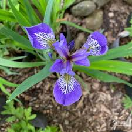

# RealESRGAN: 이미지 업스케일링 프로젝트

이 프로젝트는 `RealESRGAN`을 사용하여 이미지 및 비디오의 해상도를 향상시키는 방법을 제공합니다. `RealESRGAN`은 딥러닝 기반의 초해상도 모델로, 이미지를 고해상도로 변환할 수 있습니다.

## 프로젝트 구조

- `run.py`: 이미지 업스케일링을 실행할 파일.
- `weights/`: RealESRGAN 모델 가중치 파일이 저장된 폴더.
- `RealESRGAN/`: `RealESRGAN`의 코드 및 모델 파일을 포함한 폴더.

## 설치 방법

이 프로젝트를 로컬 환경에 설치하려면, 먼저 필요한 패키지를 설치해야 합니다. 아래의 단계에 따라 설치해 주세요.

### 1. 저장소 클론

```bash
git https://github.com/ai-forever/Real-ESRGAN.git
```

### 2. `huggingface_hub` 라이브러리 설치

만약 `huggingface_hub` 라이브러리에서 문제가 발생하면, 아래 명령어로 버전을 맞춰 설치할 수 있습니다:

```bash
pip install huggingface_hub==0.11.0
```

### 이미지 업스케일링

이미지를 2배, 4배, 또는 8배로 업스케일링하려면, 아래의 명령어를 실행하세요:

##### 예시
```bash
python upscale.py input_image.jpg output_image_x4.jpg --scale 4
```

이 명령어는 `input_image.jpg` 이미지를 4배 업스케일링하여 `output_image_x4.jpg`로 저장합니다.

## 지원되는 스케일 범위

- `2x`, `4x`, `8x` 스케일이 지원됩니다.

## 주의사항

- `RealESRGAN`은 고사양의 GPU에서 최적화된 성능을 발휘합니다. CPU에서는 처리 속도가 느릴 수 있습니다.
- `huggingface_hub` 라이브러리와 관련된 문제는 버전 문제로 발생할 수 있습니다. 이를 해결하기 위해 `huggingface_hub` 라이브러리의 버전을 `0.11.0`으로 다운그레이드하거나 최신 버전으로 업데이트할 수 있습니다.

## Examples

input image   


x2 upscale image   


x4 upscale image   


x8 upscale image  


