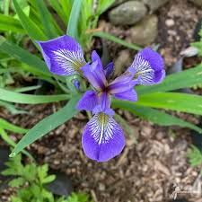

# RealESRGAN: 이미지 업스케일링 프로젝트

이 프로젝트는 `RealESRGAN`을 사용하여 이미지 및 비디오의 해상도를 향상시키는 방법을 제공합니다. `RealESRGAN`은 딥러닝 기반의 초해상도 모델로, 이미지를 고해상도로 변환할 수 있습니다.

## 프로젝트 구조

- `run.py`: 이미지 업스케일링을 실행할 파일.
- `weights/`: RealESRGAN 모델 가중치 파일이 저장된 폴더.
- `RealESRGAN/`: `RealESRGAN`의 코드 및 모델 파일을 포함한 폴더.

### 클론

```bash
git https://github.com/ai-forever/Real-ESRGAN.git
```

### `huggingface_hub` 라이브러리 설치

만약 `huggingface_hub` 라이브러리에서 문제가 발생하면, 아래 명령어로 버전을 맞춰 설치할 수 있습니다:

```bash
pip install huggingface_hub==0.11.0
```

### PyTorch GPU 버전 문제

설치한 PyTorch가 CPU 전용 버전일 가능성 있음.

```python
import torch
print(torch.version.cuda)        # CUDA 지원 버전
print(torch.cuda.is_available()) # True/False
```

GPU를 인식하지 못한다면
```
pip install torch torchvision torchaudio --index-url https://download.pytorch.org/whl/cu121
```

### 이미지 업스케일링

이미지를 2배, 4배, 또는 8배로 업스케일링 함수 실행:

##### 예시
```python
upscale_image("image.jpg", "output/image_x4.jpg", scale=4)
```
원하는 output폴더/파일명 지정 가능
scale 파라미터로 배수 2, 4, 8로 조절 가능

## 주의사항

- `RealESRGAN`은 고사양의 GPU에서 최적화된 성능을 발휘합니다. CPU에서는 처리 속도가 느릴 수 있습니다. 따라서 본 코드는 CUDA코어를 사용을 권장하고 있습니다.
- `huggingface_hub` 라이브러리와 관련된 문제는 버전 문제로 발생할 수 있습니다. 이를 해결하기 위해 `huggingface_hub` 라이브러리의 버전을 `0.11.0`으로 다운그레이드하거나 최신 버전으로 업데이트할 수 있습니다.

## Examples

input image   


x2 upscale image   

##### 2배는 품질도 눈에 띄게 좋아지고 뭉게지는 표현이 거의 없음

x4 upscale image   

##### 4배는 해상도는 높아졌으나 뭉게지는 부분이 보임

x8 upscale image  

##### 이미지가 좋아졌다고 보기 힘들 정도의 결과물

